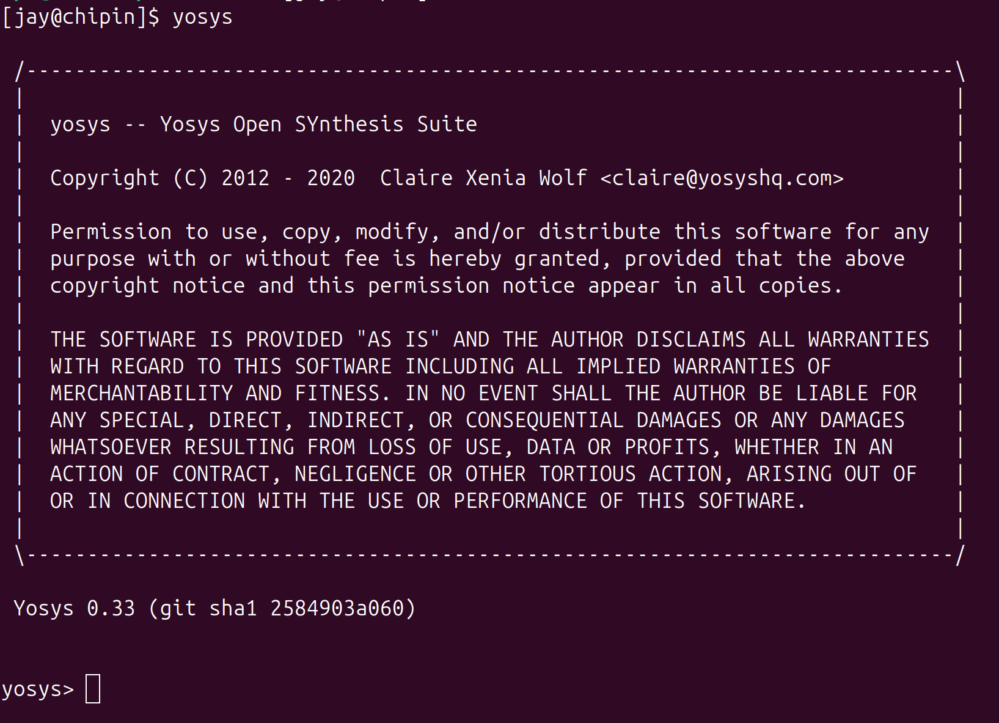
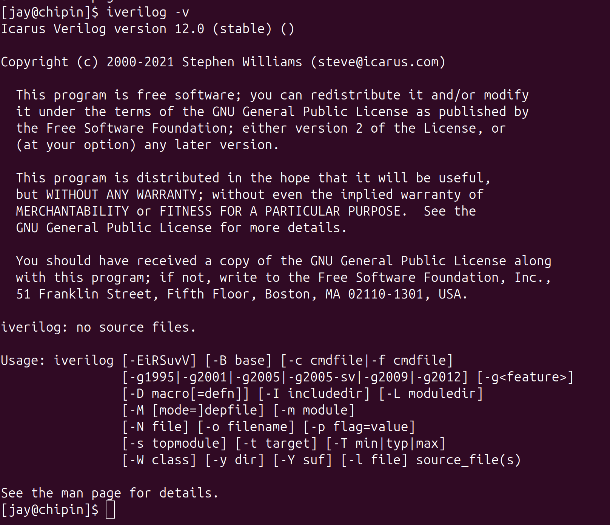
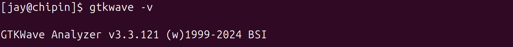

# 🚀 RISC-V Reference SoC Tapeout Program (VSD)

## 🔧 Tools Installation Guide

---

### ✅ System Requirements

Make sure your system meets the following requirements before starting installation:

- **💻 OS:** Ubuntu 20.04 or higher  
- **🧠 RAM:** 6 GB or more  
- **💾 Storage:** 50 GB HDD/SSD free space  
- **⚙️ CPU:** 4 vCPUs  

---

### 🔍 Tool Setup & Installation

#### 1️⃣ Yosys – RTL Synthesis Tool

Yosys is used for synthesizing Verilog RTL designs.

**Installation steps:**
```bash
sudo apt-get update
git clone https://github.com/YosysHQ/yosys.git
cd yosys
sudo apt-get install make build-essential clang bison flex \
    libreadline-dev gawk tcl-dev libffi-dev git \
    graphviz xdot pkg-config python3 \
    libboost-system-dev libboost-python-dev \
    libboost-thread-dev libboost-test-dev
make config-gcc
git submodule update --init --recursive
make 
sudo make install
```

**✔ Explanation:**
- `git clone` → Downloads Yosys source code
- `apt-get install` → Installs required dependencies
- `make` → Compiles the source code
- `sudo make install` → Installs Yosys globally

---

#### 2️⃣ Icarus Verilog (iverilog) – Verilog Simulator

Icarus Verilog is used for compiling and simulating Verilog HDL.

**Installation steps:**
```bash
sudo apt-get update
sudo apt-get install iverilog
```

**✔ Explanation:**
- Installed directly from Ubuntu’s package manager.

---

#### 3️⃣ GTKWave – Waveform Viewer

GTKWave is used to visualize simulation waveforms (.vcd files).

**Installation steps:**
```bash
sudo apt-get update
sudo apt-get install gtkwave
```

**✔ Explanation:**
- Simple one-command installation for waveform debugging.

---

### 🛠️ Verification

Run the following commands to confirm installations:

```bash
yosys



iverilog -V



gtkwave -V


```

✅ If all versions are displayed correctly, your setup is successful.

---

### 📊 Tools Summary

- **Yosys** → RTL synthesis → `yosys`
- **Icarus** → Verilog simulation → `iverilog -V` 
- **GTKWave** → Waveform visualization → `gtkwave --version`
---

### 🎯 Summary

By completing these steps, you will have:

- **Yosys** → RTL synthesis
- **Icarus Verilog (iverilog)** → HDL simulation
- **GTKWave** → Waveform visualization

✅ Ready to use for the RISC-V SoC Tapeout flow 🚀
